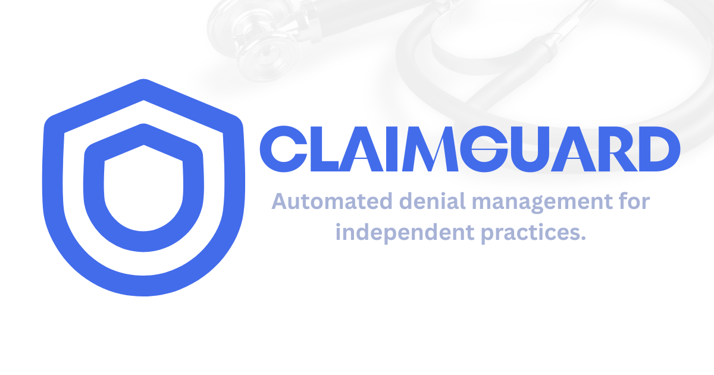

# ClaimGuard



ClaimGuard automates insurance denial processing for small medical practices.
Forward an EOB or denial PDF → AI extracts, classifies, and drafts a professional
appeal letter → your biller reviews in minutes instead of hours. Built-in
deadline tracking, response monitoring, and denial analytics keep you on top of
every claim.

## Quick Start

**Prerequisites:** Python 3.12, Node 22, Docker Desktop.

```bash
docker compose up -d                          # Postgres 16

# Backend
cd backend
py -3.12 -m venv .venv
.venv\Scripts\python.exe -m pip install -r requirements.txt
cp .env.example .env                          # edit ANTHROPIC_API_KEY (or use fake LLM in tests)
.venv\Scripts\python.exe seed.py --reset      # create tables + seed demo data
.venv\Scripts\python.exe -m uvicorn app.main:app --port 8000

# Frontend
cd frontend
cp .env.example .env.local                    # edit BETTER_AUTH_SECRET + DATABASE_URL (Neon)
npm install
npm run dev                                   # http://localhost:3000
```

Open `http://localhost:3000`, sign up with any email/password, and you'll land on a
pre-seeded dashboard with 16 demo claims covering every workflow state.

## How It Works

1. **Upload a denial PDF** — drag-and-drop or forward to your AgentMail inbox
2. **AI parses & classifies** — extracts patient/payer/codes, then recommends
   *appeal*, *resubmit*, or *write-off*
3. **Review the AI-drafted letter** — edit inline with the rich text editor
4. **Download as PDF or DOC** — export the letter to fax, mail, or upload to the payer portal
5. **Mark submitted** — auto-calculates the expected payer response date
6. **Track response** — *Needs Action* flags submitted appeals past the expected
   response window so you know exactly when to follow up

## Key Features

- **AI-drafted appeal letters** — provider-agnostic LLM layer (Anthropic out of the box,
  swappable via env vars)
- **Rich text editor** — review and edit letters inline with TipTap (bold, lists,
  headings, undo/redo)
- **Deadline + response tracking** — filing deadlines from denial date, response
  windows from submission date, overdue alerts
- **Export to PDF & DOC** — professional letterhead-ready downloads
- **Needs-Action queue** — two views: *Drafts Near Deadline* and *Awaiting Payer
  Response* with aging indicators (amber at 30d, red at 60d)
- **Denial analytics** — denial rate by payer, revenue at risk by category,
  appeals in progress, avg days to resolution
- **Idempotent ingestion** — re-uploading the same EOB won't create duplicates
- **AgentMail email-in** — forward denials to a dedicated inbox; webhook triggers
  the full pipeline

## Architecture

| | Technology |
|---|---|
| **Backend** | FastAPI, LangGraph (parse → classify → draft → critique pipeline), SQLAlchemy |
| **Database** | **AWS Aurora PostgreSQL (Serverless v2)** in production; Docker Postgres for local dev |
| **Hosting** | **AWS EC2** (Caddy + uvicorn, auto-HTTPS) for the API; **Vercel** for the frontend |
| **Infra-as-code** | **Terraform** — the entire AWS stack is defined in [`infra/`](infra/) |
| **Frontend** | Next.js 16 (App Router), React 19, Tailwind v4, shadcn/ui, hugeicons |
| **Auth** | Better Auth (Neon Postgres), JWT-verified between frontend and backend |
| **LLM** | Anthropic Claude via langchain-anthropic, provider-agnostic abstraction |
| **Email** | AgentMail inbound webhook with Svix signature verification |

The pipeline graph is rebuilt per request, with nodes closing over a
request-scoped SQLAlchemy session. Persistence is idempotent:
match-or-create for patient/payer/claim, duplicate denials guarded on
`(claim_id, denial_code, denial_date)`.

## Deployment (AWS)

The production API is **live** at **`https://apiclaimguard.otito.site`**
(`/health` → `{"status":"ok"}`). It runs entirely on AWS, with the API and
database co-located in `eu-north-1` for low latency:

```
Vercel (Next.js) ──HTTPS──▶ EC2 t4g.small ──private VPC──▶ Aurora Serverless v2
                            (Caddy + uvicorn)              (scale-to-0)
```

- **Aurora PostgreSQL Serverless v2** — scales to zero when idle; standard
  password auth with normal connection pooling.
- **EC2 (Graviton/arm64)** — runs the FastAPI app under `systemd`; **Caddy**
  reverse-proxies it with an automatic Let's Encrypt certificate. The database is
  reachable only from the app's security group (no public DB exposure).
- **Vercel** — hosts the Next.js frontend.

The whole stack is **infrastructure-as-code** in [`infra/`](infra/) (Terraform +
cloud-init). To stand up a fresh environment:

```bash
cd infra
cp terraform.tfvars.example terraform.tfvars   # fill in domain, IP, API keys
terraform init
terraform plan        # review what will be created
terraform apply       # build it
```

See [`infra/README.md`](infra/README.md) for a full walkthrough (written for
first-time Terraform users). Local development still uses Docker Postgres per the
Quick Start above — no AWS account required.

## Commands

```bash
# Backend (from backend/)
.venv\Scripts\python.exe -m pytest -q                # full suite (fake LLM)
.venv\Scripts\python.exe -m pytest -q -m "not live"  # skip real-Anthropic test
.venv\Scripts\python.exe -m pytest tests/test_pipeline.py::test_name  # single

# Frontend (from frontend/)
npm run typecheck    # tsc --noEmit
npm run lint         # eslint
npm run format       # prettier
```

## Configuration

See `backend/.env.example` and `frontend/.env.example` for all available vars.
Key ones:

| Var | Purpose |
|---|---|
| `ANTHROPIC_API_KEY` | Required for LLM features (backend) |
| `LLM_PROVIDER` / `LLM_MODEL` | Swap providers without code changes |
| `DATABASE_URL` (frontend) | Neon Postgres for Better Auth tables |
| `DATABASE_URL` (backend) | Docker Postgres for app data |
| `BETTER_AUTH_SECRET` | Session / JWT signing secret |
| `CORS_ORIGINS` | Comma-separated, no trailing slashes |

## Gotchas

- **Python 3.12 only.** Dependencies lack wheels for 3.14.
- **Tests require Docker Postgres.** The suite forces `DB_IAM_AUTH=false`.
- **No Azure/OpenAI config out of the box.** Trust `.env.example`, not the old
  README references to `OPENAI_API_KEY`.
- **`claimgaurd_TRD.md` typo is intentional** — don't rename it.
- **Frontend `.env.local`** (not `.env`) is the Next.js convention.
- **`npm run test` does not exist** — the README previously referenced it in error.
