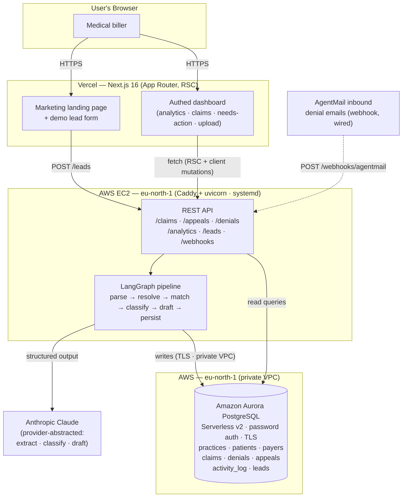

# ClaimGuard — H0 Hackathon Submission

**Track:** Monetizable B2B App (Healthcare / Insurance)
**AWS Database:** Amazon Aurora PostgreSQL (Serverless v2)
**Backend:** FastAPI on AWS EC2 (Caddy + uvicorn, auto-HTTPS) — live at `https://apiclaimguard.otito.site`
**Frontend:** Next.js 16 deployed on Vercel
**Infra-as-code:** Terraform (`infra/`)
**Tag:** #H0Hackathon

---

## What it is

ClaimGuard is a B2B SaaS tool that automates insurance **claim-denial processing**
for small medical practices. A biller uploads an EOB / denial PDF (or forwards a
denial email); ClaimGuard extracts and classifies the denial with an LLM, drafts
an appeal letter when one is warranted, tracks the payer's appeal deadline, and
surfaces analytics, a claims worklist, and a "needs action" queue on a dashboard.

Small practices lose real revenue to denials they never appeal because the manual
workflow (read the EOB, look up the denial code, decide resubmit vs. appeal vs.
write-off, draft the letter, beat the filing deadline) doesn't scale. ClaimGuard
turns that into an automated pipeline.

---

## Which AWS database, and how it's used

**Amazon Aurora PostgreSQL** is the system of record for every entity in the
product: practices, patients, payers, claims, denials, appeals, an append-only
`activity_log`, and inbound sales `leads` from the landing page. All money fields
are stored as exact `NUMERIC` (no float drift) and the relational model enforces
the claim → denial → appeal lifecycle with foreign keys and uniqueness
constraints used for idempotency (a re-uploaded EOB never double-writes a denial,
guarded on `(claim_id, denial_code, denial_date)`).

Production runs Aurora as **Serverless v2** (scale-to-zero when idle) inside the
default VPC, reachable **only** from the API server's security group — no public
database exposure. The backend connects with standard password auth over TLS
(`sslmode=require`); the master password is generated once by Terraform and
injected into both the cluster and the app's `.env`, so it's never copied by
hand. The API itself runs on an **EC2** instance (Graviton/arm64) under
`systemd`, with **Caddy** reverse-proxying it and issuing an automatic Let's
Encrypt certificate — live at `https://apiclaimguard.otito.site`. The whole
stack is **infrastructure-as-code** in [`infra/`](infra/) (Terraform +
cloud-init).

The same application code also supports a **zero-cost free-tier alternative**:
Aurora's "express configuration" (no VPC, no master password) reached over its
managed internet-access gateway using short-lived **RDS IAM authentication
tokens** (a fresh boto3-signed token per connection, `NullPool` because the
gateway reaps idle connections). That path is selected with `DB_IAM_AUTH=true`;
the production deploy above leaves it `false` and uses `DATABASE_URL`. Either
way the identical code runs against local Docker Postgres in development — only
environment variables differ.

---

## Architecture

### Request flow (PDF upload → appeal)

1. Biller uploads an EOB PDF on the Vercel dashboard → `POST /claims/upload`.
2. The **LangGraph pipeline** runs synchronously: `parse_eob` (Claude document
   block, pdfplumber fallback) → `resolve_patient_and_payer` →
   `match_or_create_claim` → `classify_denial` (resubmit / appeal / write_off) →
   conditional `draft_appeal` → `persist`.
3. All writes land in **Aurora** in one transaction; the appeal deadline is
   computed as `denial_date + payer.appeal_window_days`; every step appends to
   `activity_log`.
4. The dashboard reads back analytics, the claims list, and the needs-action
   queue (drafted appeals with deadlines ≤ 7 days) from Aurora.

The same `run_pipeline()` entrypoint backs both the manual upload and the
AgentMail webhook, so email-in ingestion reuses the exact pipeline.

---

## Tech stack

| Layer | Technology |
|-------|-----------|
| Frontend | Next.js 16 (App Router, React Server Components), Tailwind v4, shadcn/ui, deployed on **Vercel** |
| Backend | FastAPI, LangGraph, SQLAlchemy 2.0 (sync), Pydantic v2 — on **AWS EC2** (Caddy + uvicorn, auto-HTTPS) |
| AI | Anthropic Claude via a provider abstraction (`init_chat_model`) — swappable to Bedrock with no code change |
| Database | **Amazon Aurora PostgreSQL** (Serverless v2, password auth, private VPC; free-tier IAM-auth path also supported) |
| Infra | **Terraform** — the whole AWS stack as code in `infra/` |
| Email-in | AgentMail webhook (wired to the same pipeline) |

---

## Submission checklist

- [x] AWS database named and explained — **Amazon Aurora PostgreSQL** (above)
- [x] Architecture diagram (above)
- [x] Live API on AWS — `https://apiclaimguard.otito.site` (`/health` → ok)
- [ ] Vercel project link + Team ID
- [ ] Proof of Aurora usage (AWS Console screenshot of the cluster)
- [ ] Demo video (< 3 min, YouTube)
