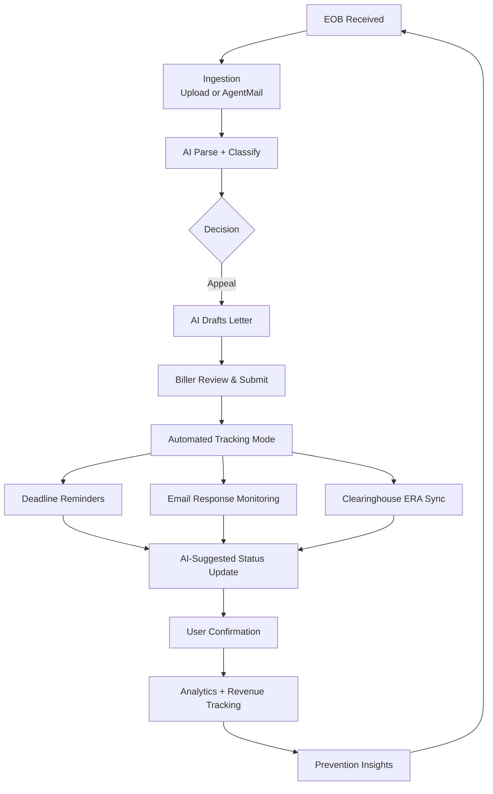

# ClaimGuard — Appeal Tracking Automation

This document outlines how to evolve ClaimGuard from **appeal drafting** to **full appeal lifecycle automation**, based on how small medical practices actually track and manage denied claims.

---

## Current State (MVP)

- AI drafts professional appeal letters
- Appeals start in `drafted` status
- Manual updates via `PATCH /appeals/{id}` (submitted → won/lost)
- Needs-Action queue shows drafted appeals nearing deadline
- Basic deadline calculation using `payers.appeal_window_days`

**Strength**: Good starting point for hackathon demo.  
**Limitation**: After submission, tracking becomes mostly manual.

---

## Why Automate Appeal Tracking?

Small practices lose significant revenue because:
- Appeal deadlines are missed (90–180 days typical)
- Payer responses get buried in email or paper
- No visibility into aging appeals
- Manual follow-up is inconsistent

Automating tracking turns ClaimGuard into a complete denial management system.

---

## Proposed Automation Roadmap

### Phase 1: Basic Automation (Quick Wins — 1–2 weeks)

1. **Smart Reminders**
   - Email (and optional SMS) notifications for appeals with <7 days to deadline
   - Daily digest: “You have 8 appeals due this week”

2. **Enhanced Needs-Action Queue**
   - Show both `drafted` and `submitted` appeals
   - Aging indicators (30/60/90+ days since submission)
   - One-click status updates: “Mark as Submitted”, “Mark as Won”, “Mark as Lost”

3. **Improved Analytics**
   - Appeals in Progress (submitted but unresolved)
   - Appeal Win Rate % by payer
   - Average days to resolution
   - Revenue recovered vs. still at risk

4. **Activity Log Enhancements**
   - Auto-log every status change with timestamp and actor

---

### Phase 2: Email-Based Automation (High Impact — 3–6 weeks)

Leverage your existing **AgentMail** setup:

- Create a second inbox: `appeal-responses-{practice}@yourdomain.com`
- Register webhook for incoming payer emails
- AI parses response emails → suggests status update:
  - “Won – $1,247.50 recovered”
  - “Lost – new denial code CO-97”
  - “More information requested”
- User confirms update with one click
- Auto-attach response to the appeal record

**This is very realistic** — many payers still communicate appeal outcomes via email.

---

### Phase 3: Clearinghouse / ERA Integration (Production Grade)

- Connect to common clearinghouses (Change Healthcare, Office Ally, Claim.MD, etc.)
- Automatically pull **835 ERA** files (Electronic Remittance Advice)
- Match payments/denials back to appealed claims
- Auto-update appeal status and recovered amount
- Support **276/277** claim status inquiries

---

## Updated Workflow Diagram



---

## Technical Implementation Notes

### Backend Changes Needed
- New table fields: `appeals.last_followup_date`, `appeals.payer_response_summary`
- New endpoint: `POST /appeals/{id}/update-status`
- Background worker for email parsing + ERA polling
- Enhanced LangGraph node for response classification

### Database Extensions
```sql
ALTER TABLE appeals 
ADD COLUMN status_updated_at TIMESTAMP,
ADD COLUMN payer_response_text TEXT,
ADD COLUMN recovered_amount NUMERIC;
```

### AI Prompt for Response Parsing
```
You are analyzing an insurance appeal response. Extract:
- New status (won / lost / partial / more_info)
- Amount paid (if any)
- New denial code or reason (if applicable)
- Key excerpts from the letter
```

---

## Priority Recommendation

**Start with Phase 1 immediately after the hackathon.**

It requires minimal new infrastructure but delivers huge perceived value. Then move to email-based tracking using your existing AgentMail strength.

---

## Expected Impact

- Increase appeal follow-through rate from ~40% to 85%+
- Reduce manual tracking time dramatically
- Stronger monetization story: “Full denial lifecycle management”

---

*Last updated: June 17, 2026*

---

